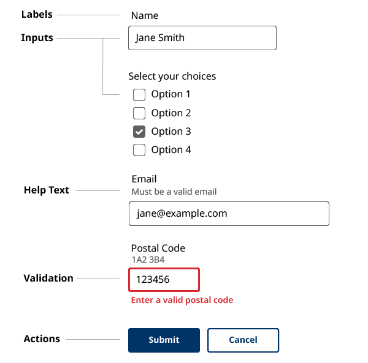

# Forms
Forms are one of the most important interactions users will have with your service. A well-designed form will help ensure you are able to deliver your service effectively. This guidance provides the foundations of how to structure a form for your digital service.

Forms are comprised of 5 elements:
1. **Labels** inform users what data needs to be entered in the corresponding input field.
2. **Input fields** enable users to provide data through different types of input fields like text inputs, checkboxes, and radio buttons.
3. **Help text** instructs users on how to fill out an input field. Help text is optional.
4. **Validation** ensures the data submitted by the user conforms to acceptable parameters.
5. **Actions** allow users to navigate or submit a form.

## Form Design

### Split your questions across pages
You should split your form questions across multiple pages with each page containing one question or a group of closely related questions. Splitting questions across pages helps users focus and understand what’s being asked of them.

For example:
- Showing one piece of information you’re telling a user (for example, fees)
- Asking them to make one decision (for example, accepting the terms of use)
- Asking one question they have to answer (for example, what is your address?)

If your service has multiple paths based on conditional logic, splitting questions will better support this without having users being exposed to questions that aren’t relevant to them.

### Use a single column layout
- Align questions and input fields vertically in a single column (one on top of another).
- This layout is easier to use for sighted users and is structured for mobile devices by default.

### Input field design
- Left align questions and labels above the input fields.
- Use sentence case for questions and labels.
- Identify if specific formatting is required with help text (for example, if date needs to be in YYYY-MM-DD format).
- Match the input field width to the expected response (for example, postal code should imply a response that fits 6 characters).
- Do not split single data entries into multiple input fields (for example, separating an area code from a phone number).

### Required vs. optional fields
- All fields in a form should be considered required. You should make sure you know why you’re asking every question and only ask users for information you really need.
- You should minimize the number of questions asked by removing as many optional ones as you can. To help you work out what to ask, you can carry out a question protocol.
- If you ask for optional information, mark the labels of these fields with “(optional)”.
- Do not use a red asterisk to indicate required fields. Red asterisks can be hard to see, and screen readers ignore them.

### Converting paper forms to digital
Make sure you do a proper review of your paper form if you are converting it into a digital service.
- Confirm that the content of the information collection notice [link to pattern] is accurate.
- If there are any ‘terms and conditions’ present, confirm they are still accurate and don’t need revision for the web.
- Forms are a managed business asset, which is why you’ll see a form number such as FIN 743 at the bottom of printed forms. All forms are tracked through their life cycle, and web forms are no exception. Talk to your ministry’s forms analyst or manager as soon as possible to let them know a form is being converted or created.

## Accessibility
- Display form inputs in the same order in HTML as they appear on screen. Do not use CSS to rearrange the form controls. Screen readers narrate forms in the order they appear in the HTML.
- Provide validation messages inline with the input fields, so people using screen magnifiers can read them quickly.
- Group each set of thematically related inputs in a `<fieldset>` element. Use the `<legend>` element to offer a label within each one.
- One example of a common use of `<fieldset>` and `<legend>` is a question with radio button options for answers. The question text and radio buttons are wrapped in a `<fieldset>`, with the question itself being inside the `<legend>` tag.
- The `<fieldset>` and `<legend>` elements make it easier for screen reader users to navigate the form.
- Do not auto advance to the next input field as this can disorient those using keyboard navigation or screen readers.

---
#### References
- [GOV.UK Question Pages](https://design-system.service.gov.uk/patterns/question-pages/)
- [USDS Form Controls](https://v2.designsystem.digital.gov/components/form-controls/)
- [Carbon Design System - Forms](https://www.carbondesignsystem.com/components/form/usage)

Contains public sector information licensed under the Open Government Licence v3.0
