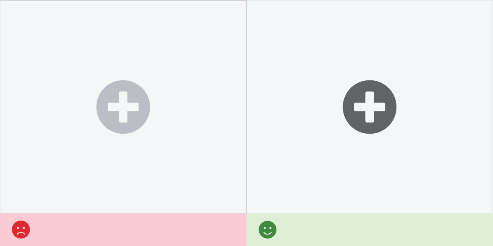

> Last Updated: February 1, 2019

# Icons
Iconography uses images and symbols to represent an idea visually. They communicate a message and should be distinct and informative.

## Implementation
The design system supports using the Font Awesome icon library. Use these icons in your application by:
*	Adding the library through the [Font Awesome CDN](https://fontawesome.com/start)
*	Hosting the [font library locally](https://fontawesome.com/how-to-use/on-the-web/setup/hosting-font-awesome-yourself) in your project source files
*	Using npm if you are using [Vue](https://fontawesome.com/how-to-use/on-the-web/using-with/vuejs), [Angular](https://fontawesome.com/how-to-use/on-the-web/using-with/angular), or [React](https://fontawesome.com/how-to-use/on-the-web/using-with/angular) components

| Icon      | Label | Class Name |
| ----------- | ----------- | ----------- |
| /icon-svgs/search.svg | Search      | `<i class="fas fa-search"></i>`|

## Design Guidance
*	Icons should be used sparingly throughout the application to provide clarity and reduce cognitive load on users.
*	Icons do not have globally recognized meaning, and will vary based on people’s past experiences. Always test the icons you use to make sure they are understandable
*	Provide a text label with icons to clarify meaning
*	Do not provide a text label when the icon is decorative
*	Use solid icons rather than outline icons

Read more about [Icon Usability - Nielsen Norman Group](https://www.nngroup.com/articles/icon-usability/)

## Accessibility

### Screenreaders
* If your icon has a text label you should hide the icon from screen readers by using the `aria-hidden="true"` attribute

* If your icon doesn’t have a text label, you’ll need to manually add a few things so that your icon is appropriately accessible
  * Hide the text label from screen readers by using the `aria-hidden="true"` attribute
  *	Provide a text alternative inside a  (or similar) element. Also include appropriate CSS to visually hide the element while keeping it accessible to assistive technologies.
  *	Include a title attribute on the icon to provide a tooltip for sighted mouse users.

Read more about [Font Awesome Accessibility](https://fontawesome.com/how-to-use/on-the-web/other-topics/accessibility)

### Icon Size
The [click or tap area](https://www.w3.org/WAI/WCAG21/quickref/#target-size) around an icon should be a minimum of 44px by 44px (WCAG 2.1 AAA)

### Colour Contrast
* Icons must have a 3:1 [color contrast ratio](https://www.w3.org/WAI/WCAG21/quickref/#non-text-contrast) (WCAG 2.1 AA) with the background colour.

## Prototyping with Font Awesome Icons
Download the [Font Awesome Icons](https://fontawesome.com/how-to-use/on-the-desktop/setup/getting-started) for your desktop to use in your mockups and prototypes.
